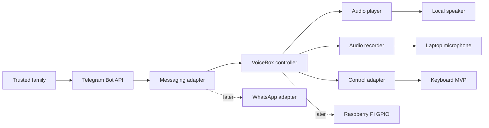

# VoiceBox Kids

VoiceBox Kids is a screen-free IoT voice messaging device that helps young children exchange voice notes with trusted family members through a deliberately simple physical interface.

The project is designed as an AI/IoT engineering portfolio piece. Its first milestone runs on a laptop with Telegram as the messaging layer; later milestones replace the keyboard, microphone, and speaker with Raspberry Pi hardware without coupling the core experience to a specific messaging provider.

## Laptop MVP

The repository includes a two-way Telegram voice-note flow:

1. listen for Telegram voice messages;
2. accept messages only from configured chat IDs;
3. download each note to a local inbox;
4. queue and play notes sequentially with one automatic retry;
5. acknowledge playback to the originating chat;
6. remove expired local media according to the retention policy;
7. return the device state to idle.
8. press Enter to start a microphone recording;
9. press Enter again to encode it as Ogg/Opus and send it to the trusted chat;
10. retry a failed upload once and remove the local recording after delivery.

The laptop uses two Enter presses because terminals cannot reliably detect key release.
The provider-neutral control contract still exposes press/release events so Raspberry Pi
can later use a physical hold-to-record button without changing the core workflow.

## Architecture



The core depends on small Python protocols rather than Telegram, a specific player, or GPIO. See [the architecture document](docs/ARCHITECTURE.md) for the component boundaries and data flow.

## Quick start

Requirements:

- Python 3.11+
- a Telegram bot token from BotFather
- a local audio command: `afplay` on macOS, or `ffplay`, `paplay`, or `mpg123` on Linux
- FFmpeg with `ffplay` for laptop recording and reliable Ogg/Opus playback

```bash
python -m venv .venv
source .venv/bin/activate
pip install ".[dev]"
cp .env.example .env
```

Run the guided setup. It verifies the bot, waits for a voice note to discover the
approved chat ID, and creates a private `.env` file without printing the token:

```bash
voicebox setup
voicebox doctor
voicebox run
```

Once running, press Enter to begin recording and press Enter again to stop and send.
On the first recording, macOS may ask for microphone access; allow it for the terminal
application where VoiceBox is running.

The setup command refuses to overwrite an existing `.env`; the file is ignored by Git
and created with owner-only permissions. Never commit real tokens.

Playback defaults to two attempts, and downloaded audio older than 24 hours is removed
at startup. Both values can be changed with `VOICEBOX_PLAYBACK_ATTEMPTS` and
`VOICEBOX_MEDIA_RETENTION_HOURS`. Uploads default to two attempts and can be changed
with `VOICEBOX_SEND_ATTEMPTS`. `TELEGRAM_OUTBOUND_CHAT_ID` selects the destination
when more than one trusted chat is configured.

`ffplay` is preferred for Telegram's Ogg/Opus voice-note format. On macOS it is
available through the `ffmpeg` package; native `afplay` is kept as a fallback but may
not decode every Telegram voice note.

## Development

```bash
pytest
ruff check .
```

## Project map

```text
src/voicebox/
├── audio/          # playback and recording boundaries
├── core/           # configuration and interaction state
├── hardware/       # laptop/Raspberry Pi control boundary
├── messaging/      # provider-neutral contract and Telegram adapter
└── main.py         # composition root and CLI entry point
```

The phased build plan is in [ROADMAP.md](docs/ROADMAP.md), and hardware assumptions are tracked in [hardware.md](docs/hardware.md).

## Safety and privacy

- Incoming messages are deny-by-default and require an explicit chat allowlist.
- Downloaded notes and failed outgoing recordings use the configured retention window.
- Successfully sent recordings are deleted from the device immediately.
- The device should be tested by an adult before use and should not be treated as an emergency communication channel.
- Secrets belong in local environment variables, never in source control.

## License

MIT © 2026 Daro05
