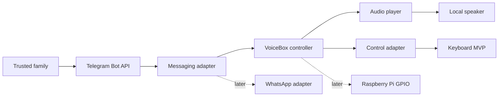

# VoiceBox Kids

VoiceBox Kids is a screen-free IoT voice messaging device that helps young children exchange voice notes with trusted family members through a deliberately simple physical interface.

The project is designed as an AI/IoT engineering portfolio piece. Its first milestone runs on a laptop with Telegram as the messaging layer; later milestones replace the keyboard, microphone, and speaker with Raspberry Pi hardware without coupling the core experience to a specific messaging provider.

## MVP status

The repository includes the first end-to-end receive path:

1. listen for Telegram voice messages;
2. accept messages only from configured chat IDs;
3. download each note to a local inbox;
4. hand it to a platform-independent audio player;
5. return the device state to idle.

Sending recordings and physical controls are intentionally represented by interfaces and follow-up milestones.

## Architecture



The core depends on small Python protocols rather than Telegram, a specific player, or GPIO. See [the architecture document](docs/ARCHITECTURE.md) for the component boundaries and data flow.

## Quick start

Requirements:

- Python 3.11+
- a Telegram bot token from BotFather
- a local audio command: `afplay` on macOS, or `ffplay`, `paplay`, or `mpg123` on Linux

```bash
python -m venv .venv
source .venv/bin/activate
pip install -e ".[dev]"
cp .env.example .env
```

Add your bot token and the numeric IDs of approved family chats to `.env`, then run:

```bash
voicebox
```

The `.env` file is ignored by Git. Never commit real tokens.

## Development

```bash
pytest
ruff check .
```

## Project map

```text
src/voicebox/
├── audio/          # playback and recording boundaries
├── core/           # configuration and interaction state
├── hardware/       # laptop/Raspberry Pi control boundary
├── messaging/      # provider-neutral contract and Telegram adapter
└── main.py         # composition root and CLI entry point
```

The phased build plan is in [ROADMAP.md](docs/ROADMAP.md), and hardware assumptions are tracked in [hardware.md](docs/hardware.md).

## Safety and privacy

- Incoming messages are deny-by-default and require an explicit chat allowlist.
- Voice notes stay on the local device after download; retention automation is planned before child testing.
- The device should be tested by an adult before use and should not be treated as an emergency communication channel.
- Secrets belong in local environment variables, never in source control.

## License

MIT © 2026 Daro05
