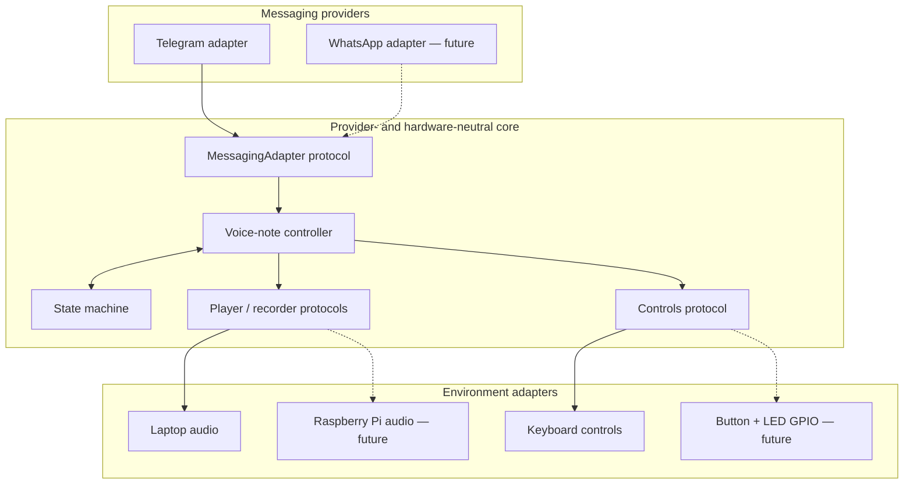
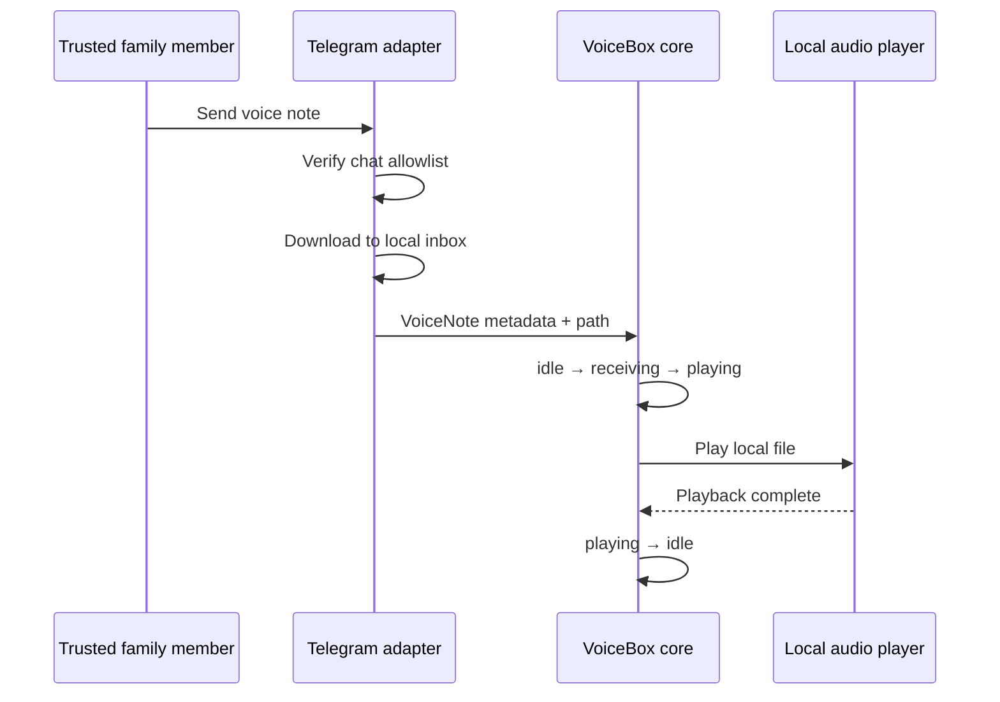

# Architecture

## Goals

VoiceBox separates the child's interaction model from transport and hardware details. The same core workflow should run first on a laptop and later on a Raspberry Pi, while Telegram can be replaced by another approved provider without rewriting the device behavior.

## Receive flow

## Design decisions

- **Ports and adapters:** protocols define messaging, audio, and controls; provider SDKs remain at the edges.
- **Deny by default:** Telegram chat IDs must be explicitly configured before the service starts.
- **Local-first media:** the core receives a local path, so playback does not depend on provider objects.
- **One interaction at a time:** the state machine makes device behavior observable and prevents ambiguous transitions.
- **Secrets outside source:** bot credentials are loaded from an ignored `.env` file or the runtime environment.

## Next implementation slice

Add a queue between receipt and playback so multiple notes are serialized, acknowledge successful playback through the messaging boundary, and enforce a configurable retention policy for downloaded media.
