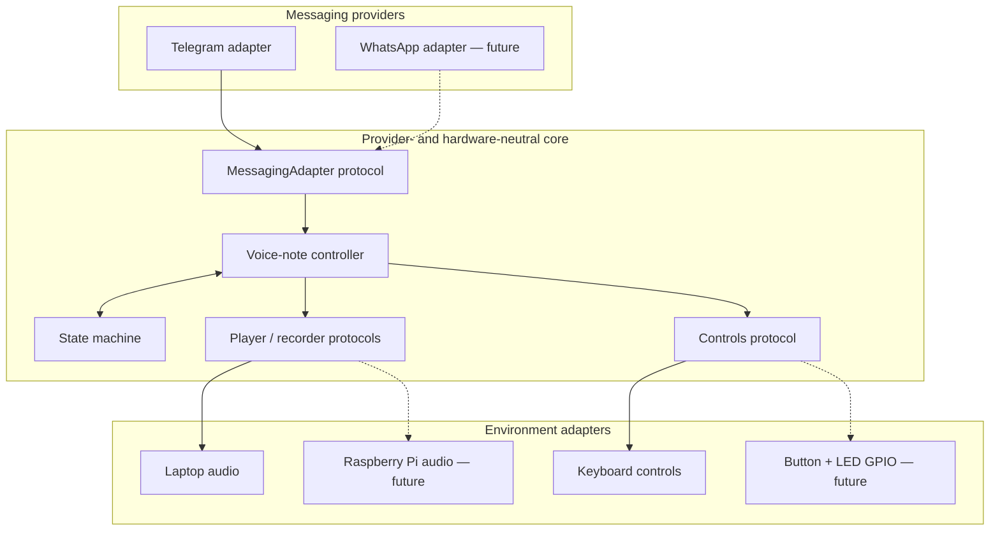
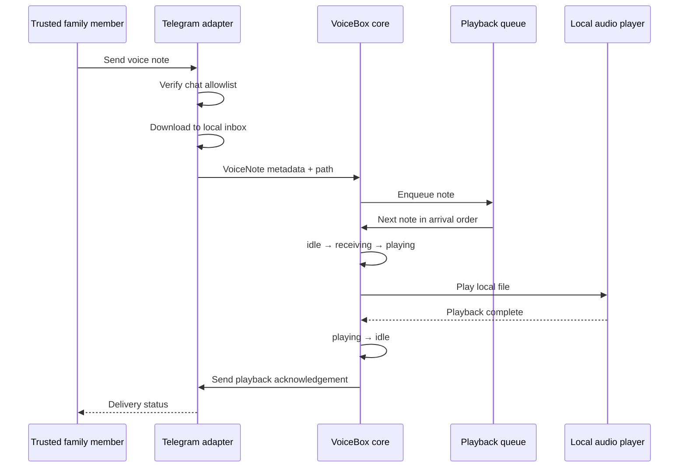
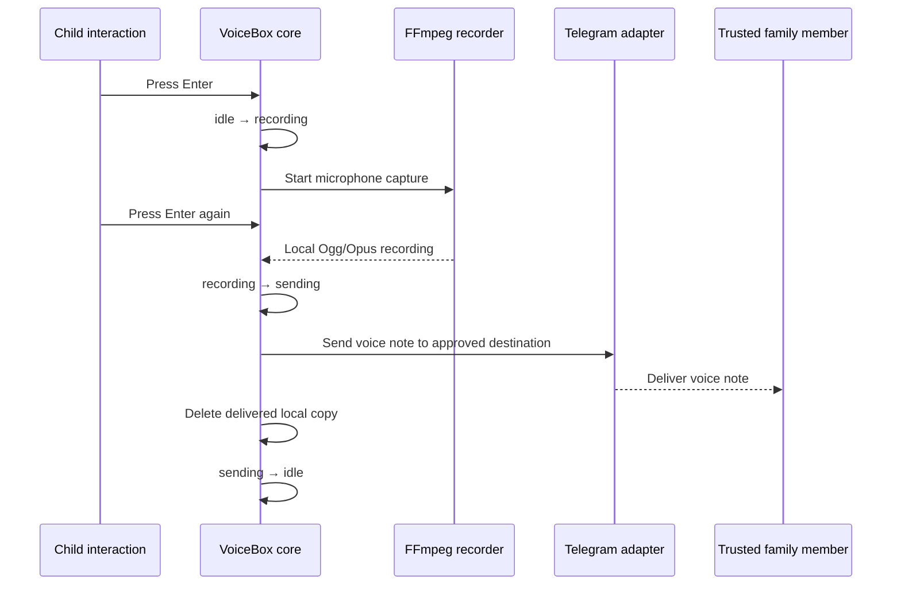

# Architecture

## Goals

VoiceBox separates the child's interaction model from transport and hardware details. The same core workflow should run first on a laptop and later on a Raspberry Pi, while Telegram can be replaced by another approved provider without rewriting the device behavior.

## Receive flow

## Send flow

## Design decisions

- **Ports and adapters:** protocols define messaging, audio, and controls; provider SDKs remain at the edges.
- **Deny by default:** Telegram chat IDs must be explicitly configured before the service starts.
- **Local-first media:** the core receives a local path, so playback does not depend on provider objects.
- **One interaction at a time:** the state machine makes device behavior observable and prevents ambiguous transitions.
- **Serialized playback:** a queue prevents overlapping notes and preserves arrival order.
- **Serialized interaction:** a shared lock prevents playback and microphone capture from overlapping.
- **Deterministic routing:** outbound notes go only to an explicitly approved chat.
- **Bounded recovery:** local playback is retried once before the family receives a failure status.
- **Private outbound media:** recordings use Ogg/Opus and are deleted after confirmed delivery.
- **Data minimization:** expired voice-note files are deleted on startup using a configurable policy.
- **Secrets outside source:** bot credentials are loaded from an ignored `.env` file or the runtime environment.

## Next implementation slice

Validate microphone permissions and the two-way interaction with adults, then add short
audio cues and a maximum recording duration before moving controls to Raspberry Pi.
